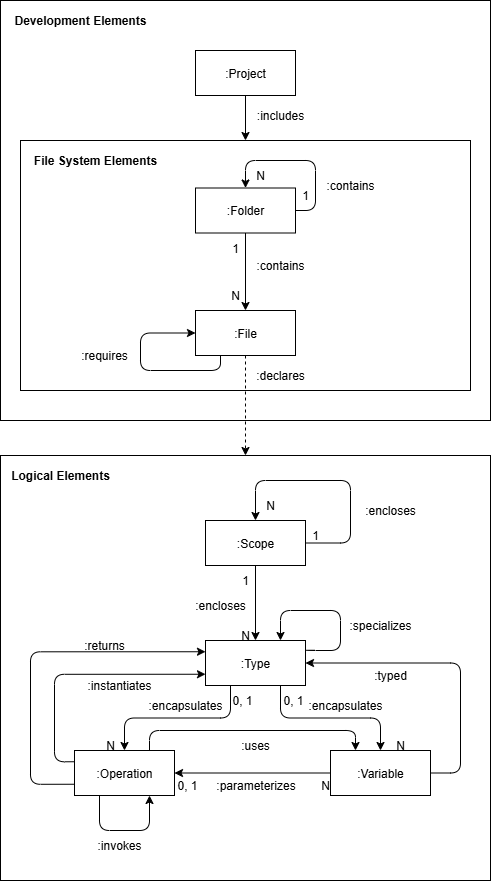

# Gophers

Knowledge graph extractor tool for source codes written in the Go programming language

## Usage

To get the required dependency, run the following command inside your Go project's root:

```bash
    $ go get github.com/rayhanp1402/gophers/extractor
```

<br>

Make sure to have Gophers cloned somewhere in your machine. If you wish to extract a knowledge graph for
your project, run:


```bash
    $ go run main.go <gophers main file path> -debug <path to your project>
```

<br>

The debug flag is completely optional. When it is enabled, Gophers will produce an `intermediate_representation`
folder that contains the abstract syntax trees and a symbol table in a plaintext format which is used to generate
the graph.

Gophers will always produce a JSON file (`graph.json`) that represents your project's knowledge graph under the
`knowledge_graph` folder.

## Visualization

Theoretically, the knowledge graphs produced by Gophers can be visualized with any visualization tools
that use the [Cytoscape.js](https://js.cytoscape.org/) JSON format. But we recommend using 
[this](https://satrio.rukmono.id/cylpg-viewer/) visualization tool instead as it is made with language-agnosticism in mind.

Below is the visualization result of Gophers' `testdata` using our recommended visualization tool:


## Ontology

The ontology/model that acts as a blueprint for the knowledge graphs generated by Gophers is shown below:



<br>

With each node represents one or more Go's code entities and each edge represents the relationships between
Go's code entities. The mapping between each of the ontology's nodes is as follow:

| **Ontology Nodes** | **Go's Code Entities** | **Brief Explanation** |
|--------------------|------------------------|------------------------|
| **Project**        | Project Root           | A root folder which contains the whole source code. |
| **Folder**         | Folders                | Folders which contain Go files. |
| **File**           | Go Files               | A file with an extension of `.go`. |
| **Scope**          | Packages               | We limit *Scope* to Go packages. We do not include block scopes because structures can only be defined inside of a package scope. |
| **Type**           | Named Types            | Includes all types with programmer-defined names. |
|                    | Function and Method    | In Go, a function or a method is a first-class citizen. It can be a return type, which is why it is classified as a *Type*. |
| **Operation**      | Function and Method    | A script in Go must be inside a function or method. |
| **Variable**       | Variable               | Global variables. Local variables are not included because they are not used much between code entities. |
|                    | Parameter              | Denotes function signatures (not passed arguments). |
|                    | Field                  | Fields of a struct or an interface. |

## Acknowledgements

This is possible with the help and done as a part of a research conducted by [Satrio Adi Rukmono](https://satrio.rukmono.id/).

Related works:

* [Javapers](https://github.com/rsatrioadi/javapers/tree/main)
* [Csharpers](https://github.com/rsatrioadi/csharpers)
